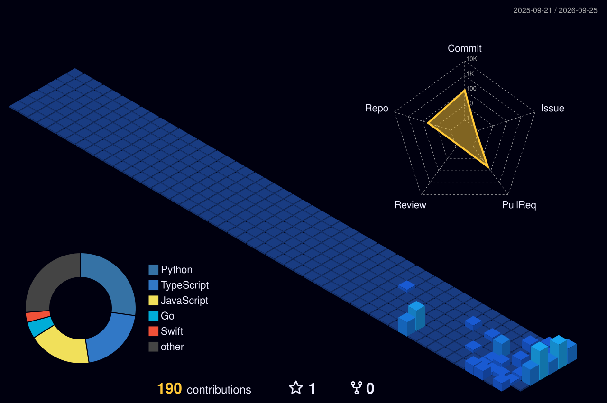

<h1 align="center">Hola, soy Alexis 👋</h1>

<!-- Snake -->

<!-- 3D contributions -->
<picture>
  <source media="(prefers-color-scheme: dark)" srcset="profile-3d-contrib/profile-night-view.svg" />
  <source media="(prefers-color-scheme: light)" srcset="profile-3d-contrib/profile-green.svg" />
  
</picture>

<table>
  <tr>
    <td valign="top" width="50%">
      <h3>Frontend</h3>
      
      
      
      
      
      
      
    </td>
    <td valign="top" width="50%">
      <h3>Backend</h3>
      
      
      
      
      
      
    </td>
  </tr>
</table>
