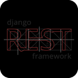

<h1 align="center">Hola, soy Alexis 👋</h1>

<!-- Snake -->

<table>
  <tr>
    <td valign="top" width="33%">
      <h3>Frontend</h3>
      
      
      
      
      
      
    </td>
    <td valign="top" width="33%">
      <h3>Backend</h3>
      
      
      
      
    </td>
    <td valign="top" width="33%">
      <h3>DevOps</h3>
         
    </td>
  </tr>
</table>
